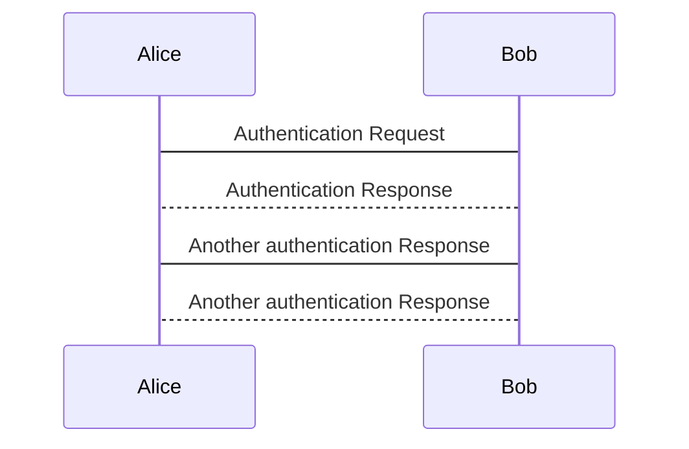

[](https://github.com/jceatwell/lootcheck-react-tdd/actions/workflows/react.js.yml)

## Configuring TDD Project

Install following libraries:

```shell
npx create-react-app lootcheck-react-tdd
npm i react-test-renderer jest-cli enzyme @wojtekmaj/enzyme-adapter-react-17 --save-dev
```

Also configure src/setUpTests.js:

```js
import '@testing-library/jest-dom';
import Adapter from '@wojtekmaj/enzyme-adapter-react-17';
import Enzyme from 'enzyme';

Enzyme.configure({ adapter: new Adapter() });
```
## Configuring Redux

Install the following

```shell
npm i redux react-redux sfcookies --save
```

## Test Library configuration

1. Delete "src" folder
2. Configure src/setUpTests.js (for tesing / Enzyme snapshoting):

```js
import '@testing-library/jest-dom';
import Adapter from '@wojtekmaj/enzyme-adapter-react-17';
import Enzyme from 'enzyme';

Enzyme.configure({ adapter: new Adapter() });
```

3. Create src/components/App.test.js file:

```js
const { shallow } = require("enzyme");
const { default: App } = require("./App");

describe('App', () => {
    const app = shallow(<App />);

    it('renders properly', () => {
        expect(app).toMatchSnapshot();
    });
});
```

4. Create basic src/components/App.js file

```js
import React, { Component } from 'react';

class App extends Component {
    render() {
        return (
            <div>
                <h2>Loot Check</h2>
            </div>
        );
    }
}

export default App;
```

5. Create index.js file to load App.js file

```js
import React from 'react';
import ReactDOM from 'react-dom';
import App from "./components/App";

ReactDOM.render(
    <React.StrictMode>
      <App />
    </React.StrictMode>,
    document.getElementById('root')
  );
```

## Redux

3 step recipe:
- The store is one data object for app 
  - represents the state of the entire application.

- Reducers update the store
  - Each reducer is like a machine that knows how to update the store and what to update the store with
  - Recureses cannot act alone though, they need message that tell them how to update the store
  
- Actions activate reducers (These are the messages)
  - Actions are objects used to identify to the reducer how to update the store
 
```plantuml
Alice -> Bob: Authentication Request
Bob --> Alice: Authentication Response
   
Alice -> Bob: Another authentication Request
Alice <-- Bob: Another authentication Response
```


